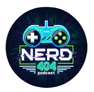

<div align="center">
  
  
  # Podcast Nerd 404 🚀
  
  **O seu portal definitivo sobre tecnologia, cultura pop e o universo geek.**

  <p align="center">
    <a href="https://reactjs.org/"></a>
    <a href="https://www.typescriptlang.org/"></a>
    <a href="https://tailwindcss.com/"></a>
    <a href="https://firebase.google.com/"></a>
    <a href="https://vitejs.dev/"></a>
  </p>
</div>

---

## 🌌 Sobre o Projeto

O **Podcast Nerd 404** não é apenas mais um site; é um **hub de conteúdo dinâmico e inteligente** feito para verdadeiros nerds. Desenhado com uma interface cyberpunk-elegante e arquitetura full-stack moderna, o portal entrega vídeos do YouTube, artigos aprofundados, cortes e episódios longos em tempo real.

"ERROR 404: Tédio não encontrado."

## ✨ Funcionalidades (Surreais)

- 🎥 **Integração Real-Time com YouTube:** Puxa e atualiza dinamicamente as thumbnails, links e títulos do *Papos de Nerd*, *Zueira Nerd Show* e *Nerds Investem*.
- ⚡ **Performance Ultra-Rápida:** SPA (Single Page Application) construído com Vite e React 18, resultando em tempos de carregamento instantâneos.
- 🎨 **UI/UX de Outra Dimensão:** Design *Neon/Dark* altamente refinado com Tailwind CSS. Elementos glassmorphism, gradientes vívidos e animações suaves na interação.
- 🗄️ **Painel Admin & CMS:** Sistema completo de administração com Firebase Firestore e Authentication. Crie, edite e publique postagens diretamente na plataforma.
- 📱 **100% Responsivo:** O Bento Grid frontal se adapta perfeitamente em telas 4K ultra-wide e em dispositivos móveis, sem quebrar o layout.

## 🛠️ Tecnologias Utilizadas

| Frontend         | Backend & DB   | Ferramentas & Hospedagem |
| :--------------- | :------------- | :----------------------- |
| React 18         | Node.js        | Vite                     |
| TypeScript       | Express        | NPM / Node               |
| Tailwind CSS     | Firebase Auth  | Lucide React (Ícones)    |
| React Router DOM | Firestore DB   | ESBuild                  |

---

## 🚀 Como Rodar Localmente

Siga o passo a passo abaixo para rodar a aplicação na sua máquina:

### 1. Clonar o repositório
```bash
git clone https://github.com/seu-usuario/podcast-nerd-404.git
cd podcast-nerd-404
```

### 2. Instalar as dependências
```bash
npm install
```

### 3. Configurar Variáveis de Ambiente
Crie um arquivo `.env` na raiz do projeto e configure as credenciais do Firebase conforme o `.env.example`:
```env
VITE_FIREBASE_API_KEY=sua_chave_aqui
VITE_FIREBASE_AUTH_DOMAIN=seu_dominio.firebaseapp.com
VITE_FIREBASE_PROJECT_ID=seu_project_id
VITE_FIREBASE_STORAGE_BUCKET=seu_bucket
VITE_FIREBASE_MESSAGING_SENDER_ID=seu_sender
VITE_FIREBASE_APP_ID=seu_app_id
```

### 4. Rodar em Ambiente de Desenvolvimento
```bash
npm run dev
```
> Acesse: `http://localhost:3000`

### 5. Fazer a Build de Produção
```bash
npm run build
npm run start
```

---

## 📸 Imagens do Projeto

> Imagine aqui capturas de tela deslumbrantes da plataforma mostrando o layout neon, o dashboard admin e os painéis com as capas dos vídeos coloridos. 

---

<div align="center">
  <b>Feito com 🤍 para os Nerds.</b><br>
  Podcast Nerd 404 © 2026. Todos os direitos reservados.
</div>
